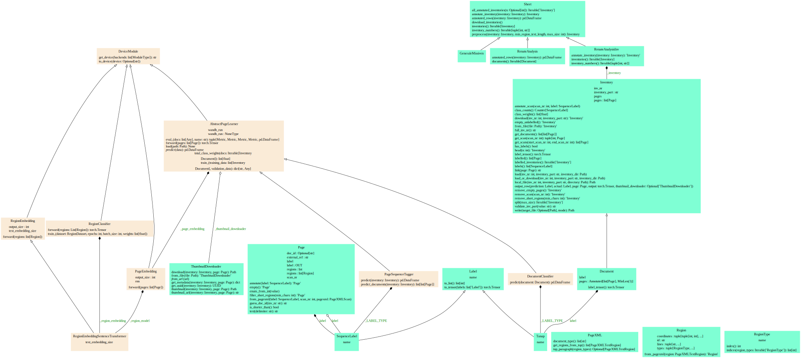

# Document Segmentation

## Preparation

### Install Poetry

```console
curl -sSL https://install.python-poetry.org | python3 -
```

Or:

```console
pipx install poetry
```

Als see [Poetry documentation](https://python-poetry.org/docs/master/#installation).

### Install the dependencies

```console
poetry install
```

## Usage

To train a model run the [`scripts/train_model.py`](scripts/train_model.py) script.
It downloads the necessary data from the HUC server into the local temporary directory.

Set your HUC credentials in the `HUC_USER` and `HUC_PASSWORD` environment variables or in [`settings.py`](document_segmentation/settings.py), and run the script.
For instance:

```console
HUC_USER=... HUC_PASSWORD=... poetry run python scripts/train_model.py
```

Add the `--help` flag to see the available options.

## Development Instructions

This project uses

- Python >= 3.9
- [Poetry](https://python-poetry.org/) for package management
- [PyTest](https://docs.pytest.org) for unit testing
- [Ruff](https://github.com/astral-sh/ruff) for linting and formatting

### Install Development Dependencies

```console
poetry install --with=dev
```

### Set up pre-commit hooks

Install pre-commit:

```console
poetry run pre-commit install
```

### Run Tests

```console
poetry run pytest
```

### Architecture

#### Classes Diagram



Run this command for updating the classes diagram:

```console
poetry run pyreverse --output svg --colorized document_segmentation
```
