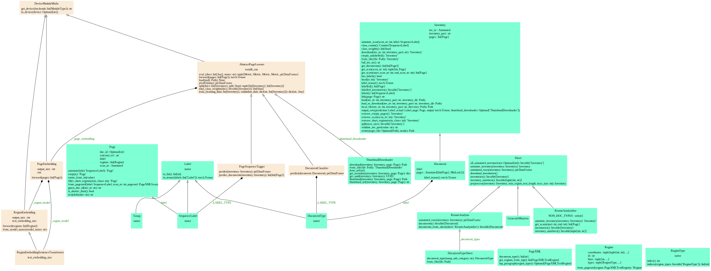

# Document Segmentation

[](https://www.python.org)
[](https://www.python.org)
[](https://www.python.org)
[](https://www.python.org)

[](https://python-poetry.org/)
[](https://github.com/pre-commit/pre-commit)
[](https://github.com/astral-sh/ruff)


## Overview

This repository provides tooling for processing VOC inventories to

1. extract document boundaries and
1. classify documents

For both cases, two scripts exist respectively:

1. train a new model
2. apply a model

### Definitions and Workflow

- An _inventory_ is a collection of pages.
- A _document_ is a subset of such pages; a document can start and end on the same page, or stretch over hundreds of pages.
- A document falls in a `TANAP category`, as defined in the `Tanap` class in [label.py](document_segmentation/pagexml/datamodel/label.py).

There are two separate tasks defined in this repository:

- segmenting inventories: identify the boundaries of individual documents inside an inventory
- classifying documents: identify the category of a document

### Training and Applying Models

For each task, there is a script to train a model:

- [train_segmentation_model.py](scripts/train_segmentation_model.py)
- [train_classifier.py](scripts/train_classifier.py)

See below for instructions on installing prerequisites and running the scripts.

Both produce a model file; run either script with the `--help` argument for the specific arguments.

In order to apply a model as produced by the respective training script, call

- [extract_docs.py](scripts/extract_docs.py) for extracting documents from an inventory
- [predict_inventories](scripts/predict_inventories.py) is variation and applies the document segmentation model on multiple inventories, optionally generating a CSV file with thumbnail for human evaluation.
- TODO: [classify_documents.py](scripts/classify_documents.py) for classifying documents

As above, run any of the scripts with the `--help` argument to get the specific usage.

## Prerequisites

### Install Poetry

```console
curl -sSL https://install.python-poetry.org | python3 -
```

Or:

```console
pipx install poetry
```

Als see [Poetry documentation](https://python-poetry.org/docs/#installation).

### Install the dependencies

```console
poetry install
```

## Usage

To _train_ a model run the [`scripts/train_model.py`](scripts/train_segmentation_model.py) script.
It downloads the necessary data from the HUC server into the local temporary directory.

Set your HUC credentials in the `HUC_USER` and `HUC_PASSWORD` environment variables or in [`settings.py`](document_segmentation/settings.py), and run the script.

```console
HUC_USER=... HUC_PASSWORD=... poetry run python scripts/train_model.py
```

Without the credentials, the script is not able to download the inventories, but can proceed with previously downloaded ones.
Add the `--help` flag to see all available options.

To extract the documents of one or more inventories using a previously trained model, use the [`scripts/predict_inventories.py`](scripts/predict_inventories.py) script, for instance:

```console
poetry run python scripts/predict_inventories.py --model model.pt --inventory 1547,1548 --output 1547_1548.csv
```

Missing inventories are downloaded from the HUC server if the `HUC_USER` and `HUC_PASSWORD` environment variables are provided.

Add the `--help` flag to see all available options.

## Development Instructions

This project uses

- Python version >= 3.9 and <= 3.12
- [Poetry](https://python-poetry.org/) for package management
- [PyTest](https://docs.pytest.org) for unit testing
- [Ruff](https://github.com/astral-sh/ruff) for linting and formatting
- [Pre-commit](https://pre-commit.com/) for managing pre-commit hooks

### Install Development Dependencies

```console
poetry install --with=dev
```

### Set up pre-commit hooks

```console
poetry run pre-commit install
```

### Run Tests

```console
poetry run pytest
```

### Architecture

Both document segmentation and classification are based on page embeddings -- defined in the `PageEmbedding` class --, and region embeddings -- defined in the `RegionEmbedding` class.
The models are implemented in the `PageSequenceTagger` and the `DocumentClassifier` class respectively, both are sub-classes of the `AbstractPageLearner` class (see diagram below).
These classes are used for document boundary detection and document type classification respectively.

The `Inventory` class is the main data class.
It holds sequences of pages and labels, and is inherited by the `Document` class, for using different labels.

The `Sheet` class and its sub-classes are used for reading and processing the annotated data from CSV/Excel sheets as stored in the [annotations](document_segmentation/data/annotations/) directory.

(Hyper-)parameters like layer sizes and language model are defined in [settings.py](document_segmentation/settings.py).

#### Classes Diagram



Run this command for updating the classes diagram:

```console
poetry run pyreverse --output svg --colorized document_segmentation
```
